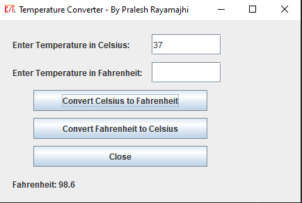

# Introduction
## This is a GUI based Java project for temperature conversion from celsius to Fahrenheit and vice versa.
### It basically uses formula °F = (°C × 9/5) + 32 to convert celsius to fahrenheit.
### Similarly for fahrenheit to celsius, it uses formula C = 5/9(F-32) to convert celsius to fahrenheit.
## Snapshot of a program
